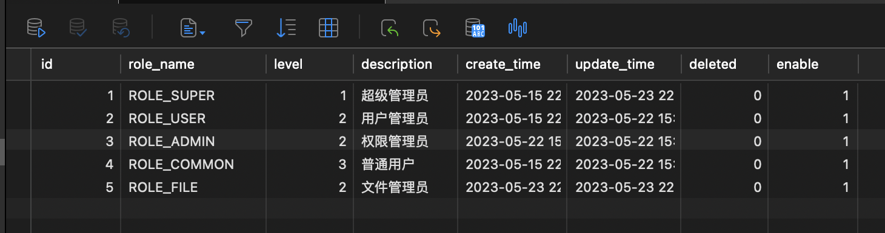
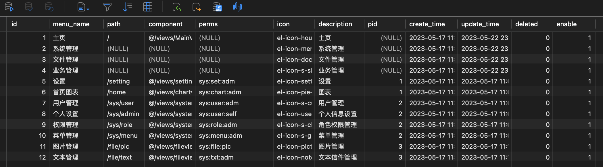

# Day2

## 权限配置

- 表的设计

  1. t_role 角色表

     

  2. t_menu 菜单表

     

  3. t_user_role 用户角色关系表

     

  4. t_role_menu 角色菜单关系表

     

- MyUserDetailsService

  根据之前保留的getUserAuthority进行扩展权限设置功能

  ```java
  //这里实现权限查询和设置
  public List<GrantedAuthority> getUserAuthority(Integer userId) {
      //这里传入一个字符串由逗号隔开
      //格式 角色格式：ROLE_ADMIN,ROLE_COMMON，权限格式：sys:user:resetPwd,sys:role:delete,sys:user:list
      //获取登录用户的权限信息
      String authority = userService.getUserAuthorityInfo(userId);
      return AuthorityUtils.commaSeparatedStringToAuthorityList(authority);
  }
  ```

  - 格式：
    - 角色格式：ROLE_ADMIN,ROLE_COMMON,...
    - 权限格式：sys:user:resetPwd,sys:role:delete,sys:user:list,...
  - 方便在后面的api接口上进行注解使用

- userService.getUserAuthorityInfo(userId) 该方法通过Mapper实现多表查询

  ```java
  public String getUserAuthorityInfo(Integer userId) {
      StringBuilder authority = new StringBuilder();
      //根据用户id获取用户的所有角色信息
      List<Role> roles = roleMapper.selectList(new QueryWrapper<Role>().inSql("id", "select role_id from t_user_role where user_id=" + userId));
      if (roles.size() > 0) {
          String roleNames = roles.stream().map(Role::getRoleName).collect(Collectors.joining(","));
          authority.append(roleNames);
      }
    
      //根据角色信息获取对应的权限信息，而且不要重复
      Set<String> sets = new HashSet<>();
      for (Role role : roles) {
          List<Menu> menus = menuMapper.selectList(new QueryWrapper<Menu>().inSql("id", "select menu_id from t_role_menu where role_id=" + role.getId()));
          for (Menu menu : menus) {
              String perms = menu.getPerms();
              if (StrUtil.isNotEmpty(perms)) {
                  sets.add(perms);
              }
          }
      }
      if (sets.size() > 0) {
          authority.append(",");
          String collect = String.join(",", sets);
          authority.append(collect);
      }
      return authority.toString();
  }
  ```

- JwtAuthenticationFilter 在jwt过滤器登录的时候就设置该用户的权限

  ```java
  @Override
  protected void doFilterInternal(HttpServletRequest request, HttpServletResponse response, FilterChain chain) throws IOException, ServletException {
      /**
      * ....
      */
      //将登录后的用户信息保存到threadlocal
      UserVo userVo = BeanUtil.copyProperties(user, UserVo.class);
      UserThreadLocal.set(userVo);
      //设置token认证和授权
      UsernamePasswordAuthenticationToken usernamePasswordAuthenticationToken = new UsernamePasswordAuthenticationToken(username, null, userDetailsService.getUserAuthority(user.getId()));
      SecurityContextHolder.getContext().setAuthentication(usernamePasswordAuthenticationToken);
      chain.doFilter(request, response);
  }
  ```

---

## Securtiy注解的使用

- 常用注解类型：
  1. @PreAuthorize("hasAnyAuthority('sys:user:adm')") 配置权限
  2. @Secured({"ROLE_SUPER", "ROLE_USER"}) 配置角色

- 使用注解之前要开启注解，在Security配置类中要开启相关注解

  @EnableGlobalMethodSecurity(securedEnabled = true, prePostEnabled = true) //用于开启security相关注解

- UserController举例

  ```java
  @Secured({"ROLE_SUPER", "ROLE_USER"})
  @PreAuthorize("hasAnyAuthority('sys:user:adm')")
  @PostMapping("/save")
  public Result saveOrUpdate(@RequestBody UserDto userDto) {
      boolean result = false;
      if (userDto.getId() == null) {
          userService.alter();
          User user = BeanUtil.copyProperties(userDto, User.class, "password");
          user.setPassword(encoder.encode("123456"));
          result = userService.saveOrUpdate(user);
      } else {
          userService.alter();
          QueryWrapper<User> wrapper = new QueryWrapper<>();
          wrapper.eq("id", userDto.getId());
          User user = BeanUtil.copyProperties(userDto, User.class, "password");
          result = userService.saveOrUpdate(user, wrapper);
      }
      if (result) {
          return Result.success();
      }
      return Result.error();
  }
  ```

  该接口就必须要用户拥有ROLE_SUPER，ROLE_USER角色以及sys:user:adm权限字段才能进行使用

---

## Swagger注解的使用

- 接口开发完成后，可以通过Swagger注解进行接口文档的详细描述，方便后期开发维护

- 启用Swagger3注解

  1. 添加依赖：

     ```xml
     <!--swagger3.0 包-->
     <dependency>
         <groupId>io.springfox</groupId>
         <artifactId>springfox-boot-starter</artifactId>
         <version>3.0.0</version>
     </dependency>
     ```

  2. 配置Swagger配置类

     ```java
     @Configuration
     @EnableOpenApi
     public class SwaggerConfig {
         /**
          * 创建api应用
          * select()返回一个ApiSelectorBuilder实例，控制接口暴露给Swagger使用
          * apis()扫描api包
          * @return
          */
         @Bean
         public Docket restApi() {
             return new Docket(DocumentationType.OAS_30)
                     .groupName("标准接口")
                     .apiInfo(apiInfo("LetterBox后台接口", "1.0"))
                     .useDefaultResponseMessages(true)
                     .forCodeGeneration(false)
                     .select()
                     .apis(RequestHandlerSelectors.basePackage("com.dxy.letterboxbackstage.controller"))
                     .paths(PathSelectors.any())
                     .build();
         }
     
         /**
          * 创建api基本信息
          * @param title
          * @param version
          * @return
          */
         private ApiInfo apiInfo(String title, String version) {
             return new ApiInfoBuilder()
                     .title(title)
                     .description("这是用于LetterBox后台管理的相关接口开发说明")
                     .termsOfServiceUrl("www.bailublog.cn")
                     .contact(new Contact("Design By Bailu", "www.bailublog.cn", "1242857354@qq.com"))
                     .version(version)
                     .build();
         }
     }
     ```

- 使用Swagger注解

  - @Api(tag = "xxx") Controller注解
  - @ApiModel("xxx") 数据对象注解
  - @ApiOperation("xxx") 接口注解

  ```java
  @Api(tags = "用户接口")
  @RestController
  @RequestMapping("/user")
  public class UserController {
      @Autowired
      UserServiceImpl userService;
  
      @Autowired
      BCryptPasswordEncoder encoder;
  
      @ApiOperation("获取所有用户信息")
      @Secured({"ROLE_SUPER", "ROLE_USER"})
      @PreAuthorize("hasAnyAuthority('sys:user:adm')")
      @GetMapping("/all")
      public Result getAllUsers() {
          List<User> users = userService.list();
          if (users != null && users.size() != 0) {
              List<UserVo> userVos = BeanUtil.copyToList(users, UserVo.class);
              return Result.success(userVos);
          }
          return Result.error();
      }
  ```

- 通过localhost:port/swagger-ui/index.html进行访问

  

- 由于之前整合了security+jwt，需要添加相关白名单，直接访问

  ```java
  "/swagger-ui/**",
  "/webjars/**",
  "/doc.html",
  "/swagger-resources/**",
  "/v3/**"
  ```

---

## 记住密码实现

- 前后端分离记住密码的功能实现在vue前端进行实现，需要将用户名和密码主动添加到浏览器Cookie中进行保存

- 通过判断是否需要记住密码即可将Cookie中保存的用户名和密码自动添加到登录表单中进行登录

  ```javascript
  //如果勾选了记住密码就要进行加密保存
  if (this.user.rememberMe) {
    Cookie.set("username", this.user.username, {expires: 30})
    Cookie.set("password", encrypt(this.user.password), {expires: 30})
    Cookie.set("rememberMe", this.user.rememberMe, {expires: 30})
  } else {
    Cookie.remove("username")
    Cookie.remove("password")
    Cookie.remove("rememberMe")
  }
  //通过Cookie获取保存的用户名和密码
  getCookies() {
    const username = Cookie.get("username")
    const password = Cookie.get("password")
    const rememberMe = Cookie.get("rememberMe")
    this.user = {
      username: username === undefined ? this.user.username : username,
      password: password === undefined ? this.user.password : decrypt(password),
      rememberMe: rememberMe === undefined ? false : Boolean(rememberMe)
    }
  }
  ```

- Cookie中保存的用户名和密码需要加密保存，不能直接进行明文保存，通过JSEncrypt工具类

  ```javascript
  import JSEncrypt from "jsencrypt"
  
  // http://web.chacuo.net/netrsakeypair
  
  //加密公钥
  const publicKey = "xxxxxxxxxx"
  
  //解密私钥
  const privateKey = "xxxxxxxxx"
  
  //加密
  export function encrypt(txt) {
      const encryptor = new JSEncrypt()
      encryptor.setPublicKey(publicKey) //设置公钥
      return encryptor.encrypt(txt) //加密
  }
  
  //解密
  export function decrypt(txt) {
      const encryptor = new JSEncrypt()
      encryptor.setPrivateKey(privateKey) //设置私钥
      return encryptor.decrypt(txt) //解密
  }
  ```

---

## 整合OSS资源服务器

- 阿里云OSS前期准备：

  1. 开通OSS服务
  2. 新建一个bucket，一个项目一个bucket即可
  3. 同时开通AccessKey，以及相关权限用于后端访问OSS服务

- 导入OSS的maven依赖：

  ```xml
  <!--OSS SDK-->
  <dependency>
      <groupId>com.aliyun.oss</groupId>
      <artifactId>aliyun-sdk-oss</artifactId>
      <version>3.10.2</version>
  </dependency>
  <!--java9以上OSS需要依赖-->
  <dependency>
      <groupId>javax.xml.bind</groupId>
      <artifactId>jaxb-api</artifactId>
      <version>2.3.1</version>
  </dependency>
  <dependency>
      <groupId>javax.activation</groupId>
      <artifactId>activation</artifactId>
      <version>1.1.1</version>
  </dependency>
  <!-- no more than 2.3.3-->
  <dependency>
      <groupId>org.glassfish.jaxb</groupId>
      <artifactId>jaxb-runtime</artifactId>
      <version>2.3.3</version>
  </dependency>
  ```

- 参考官方文档，构建OSS工具类：

  - Java SDK：https://help.aliyun.com/document_detail/84781.html?spm=a2c4g.84835.0.0.30a749bcsvSJKa
  - OSSUtils.java

  ```java
  public class OSSUtils {
      private final static String endpoint = "https://oss-cn-chengdu.aliyuncs.com";
      private final static String accessKeyId = "AccessKeyId";
      private final static String accessKeySecret = "AccessKeySecret";
      private final static String bucketName = "bucketName";
  
    	//上传图片的方法
      public static Boolean uploadImage(MultipartFile file, String fileUuid) {
          OSS ossClient = new OSSClientBuilder().build(endpoint, accessKeyId, accessKeySecret);
          try {
              InputStream inputStream = file.getInputStream();
              PutObjectRequest putObjectRequest = new PutObjectRequest(bucketName, "imgs/"+fileUuid, inputStream);
              PutObjectResult result = ossClient.putObject(putObjectRequest);
              return true;
          } catch (Exception e) {
              System.out.println(e.getMessage());
              return false;
          } finally {
              if (ossClient != null) {
                  ossClient.shutdown();
              }
          }
      }
  }
  ```

- 重写文件上传和下载的方法：FileServiceImpl.java

  - 文件上传：

    ```java
    public String uploadFile(MultipartFile file) throws IOException {
        String fileName = file.getOriginalFilename();
        String type = FileUtil.extName(fileName);
        long size = file.getSize();
    
      	//文件的唯一标识
        String uuid = IdUtil.fastSimpleUUID();
        String fileUuid = uuid + StrUtil.DOT + type;
        String url = "";
        String md5 = "";
    
        //判断文件是否已经存在
        //如果文件已存在，查询md5是否相等
        //(注：这里的md5标识符要用过文件字节码来获取，以保证能判断是否为重复文件)
        //创建文件的唯一标识，以免重复保存同样的文件（使用MD5）
        md5 = SecureUtil.md5(file.getInputStream());
        //查询是否是重复文件，如果是就不进行保存，只是简单进行记录
        com.dxy.letterboxbackstage.entity.File dbFiles = getFileMd5(md5);
        if (dbFiles != null) {
            //文件已存在
            url = dbFiles.getUrl();
        } else {
            if (OSSUtils.uploadImage(file, fileUuid)) {
                url = "https://letterbox-beta.oss-cn-chengdu.aliyuncs.com/imgs/" + fileUuid;
            } else {
                return null;
            }
        }
    
        com.dxy.letterboxbackstage.entity.File dbFile = new com.dxy.letterboxbackstage.entity.File();
        dbFile.setFileName(fileName);
        dbFile.setType(type);
        dbFile.setSize(size/1024);
        dbFile.setUrl(url);
        dbFile.setMd5(md5);
        dbFile.setEnable(true);
        alter();
        if (save(dbFile)) {
          	//回传文件url
            return url;
        } else {
            return null;
        }
    }
    
    //查询上传的文件是否重复
    private com.dxy.letterboxbackstage.entity.File getFileMd5(String md5) {
        QueryWrapper<File> wrapper = new QueryWrapper<>();
        wrapper.eq("md5", md5);
        List<File> list = list(wrapper);
        return list.size() == 0 ? null : list.get(0);
    }
    ```

  - 文件下载：文件的下载主要是通过添加后在OSS服务中文件保存的url进行下载

    ```yaml
    # 文件上传路径配置
    files:
      upload:
        path: https://letterbox-beta.oss-cn-chengdu.aliyuncs.com/imgs/
    ```

    **url = fileUploadPath + fileUuid**

    ```java
    public void download(String fileUuid, HttpServletResponse response) throws IOException {
        //根据文件唯一标识码进行下载
        java.io.File downloadFile = new java.io.File(fileUploadPath + fileUuid);
        ServletOutputStream os = response.getOutputStream();
        response.addHeader("Content-Disposition", "attachment;filename="+ URLEncoder.encode(fileUuid, "UTF-8"));
        response.setContentType("application/octet-stream");
        //读取文件字节流
        os.write(FileUtil.readBytes(downloadFile));
        os.flush();
        os.close();
    }
    ```

    

---

